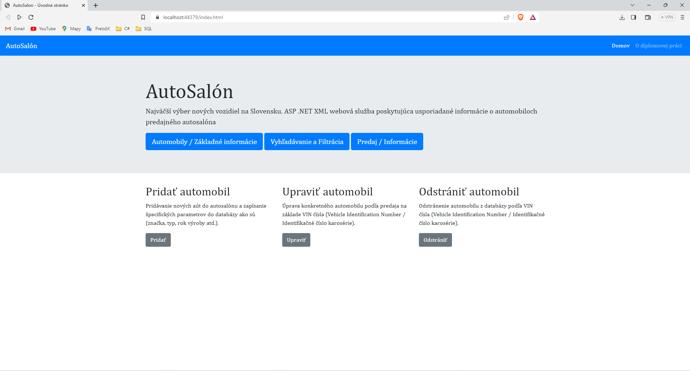

<h1 align="center">ASP .NET XML webová služba poskytujúca usporiadané informácie o automobiloch predajného autosalóna</h1>  

<h1 align="center"> Anotácia: </h1>

🥇 <i>Diplomant v práci zanalyzuje možnosti použitia XML webových služieb na sledovanie parametrov automobilov predajného autosalóna vo vybratom období v elektronickom       informačnom systéme a porovná ich použitie s doterajším spôsobom sledovania týchto parametrov vo vybraných predajných autosalónoch. </i>   
🥈 <i>V rámci diplomovej práce diplomant vo vybratom riadenom programovacom jazyku vytvorí ASP .NET XML webovú službu poskytujúcu prostredníctvom svojej funkcionality jej klientovi podľa vybraných kritérií usporiadané informácie o parametroch automobilov predajného autosalóna v sledovanom období, ktorými môžu byť celkový počet automobilov v tomto autosalóne na začiatku a konci sledovaného  
obdobia, počty a zoznamy automobilov s ich základnými dátami od jednotlivých výrobcov, vybranej značky, daného typu, počty a zoznamy automobilov s ich základnými dátami s najväčším a najmenším predajom na začiatku a konci sledovaného obdobia a iné ich parametre. </i>

<h1 align="center"> Použitá technológia: </h1>

  &nbsp;
  &nbsp;
 &nbsp;
  &nbsp;
  &nbsp;
  &nbsp;
  &nbsp; 
  &nbsp;

  

<h1 align="center"> Ukážka webového klienta: </h1>

 Úvodná stránka 

 Úvodná stránka 

